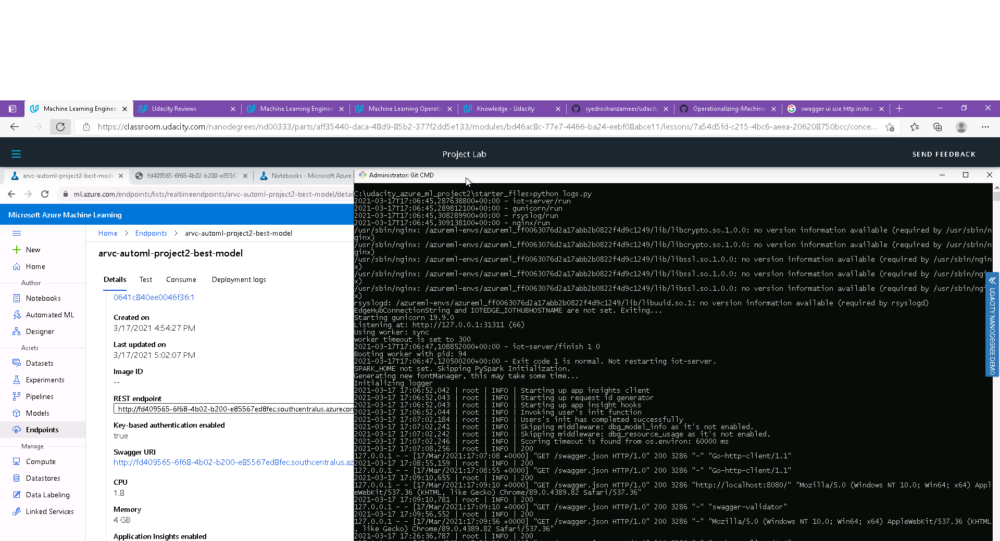
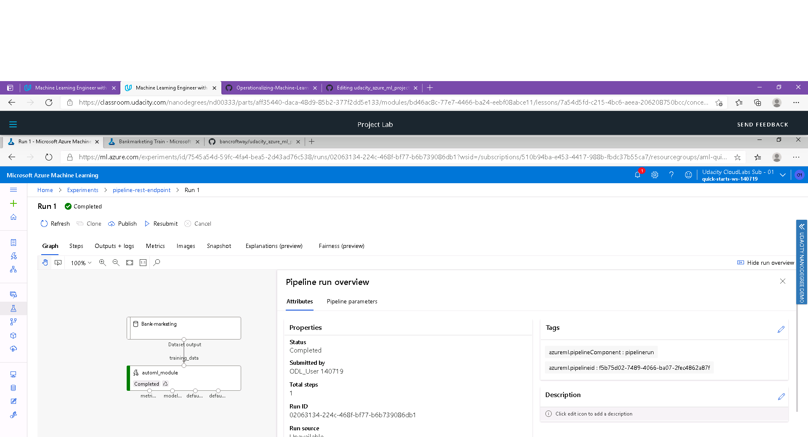

# Operationalizing Machine Learning
This project utilizes Bank Marketing classification dataset. We utilize Azure AutoML to find the best performing model.
2 separate methods are utilized to operationalize the ML model:
1. An AutoML model is trained directly through the Python SDK. The best model is then exposed as a REST api endpoint.
2. A pipeline is used to perform AutoML training. The pipeline is exposed as a REST api endpoint. The best model is also exposed as a REST api endpoint.

The models are deployed through Azure Container Instance, and the REST api is secured using key based authentication. Swagger configuration for the REST endpoint is also exposed.

## Architectural Diagram

The Bank Marketing dataset is registered dataset, which can be used both directly in AutoML or in the Pipeline. An Azure AutoML model is trained, and deployed, and then this process is also further automated using a pipeline. The Pipeline takes care of finding or creating the registered dataset, and finding or creating the compute cluster, kicking off the AutoML experiment, retrieve the best model and deploy the model to a REST endpoint, through Azure Container Instance. Additionally, the model is secured using key based authentication, and logs output through Azure App Insights. Consumers of the model can interact with it using the REST endpoints. The Pipeline itself can be kicked off using a REST endpoint.

## Key Steps
1. We have registered the dataset in ML Studio. 

2. Run AutoML experiment on compute cluster (classification with best model measured by accuracy metric). 

3. From all the models explored by AutoML, select the best-performing model. 

4. Deploy the best model as an endpoint with Azure Container Instance (ACI) 

5. Enable logging (Application Insights) and view logs. 

6. Download swagger.json from the deployed model endpoint, and display SwaggerUI locally, which shows the API methods available. 

7. Using the deployed model endpoint, use the scoring endpoint. 

8. Use Apache Benchmark to benchmark the performance of the endpoint. 

9. Use Jupyter notebook to train and deploy an AutoML model as a pipeline. 

10. From the Pipeline node in ML Studio, we see the pipeline run has been completed. The Bank Marketing dataset is present and registered before being passed into the AutoML module. 

11. After waiting for the pipeline run to complete, it is is deployed as an endpoint. This REST endpoint can be invoked to trigger the pipeline 
a. The pipeline section of Azure ML studio, showing that the pipeline has been created  

b. The pipelines section in Azure ML Studio, showing the Pipeline Endpoint 

c. The Bankmarketing dataset with the AutoML module 

d. The "Published Pipeline overview', showing a REST endpoint and a status of ACTIVE 

e. In Jupyter Notebook, showing that the "Use RunDetails Widget" shows the step runs 
f. In ML studio showing the scheduled run 

## Screen Recording
https://youtu.be/zEQeMtZs7iU

## Improvements
In order to improve the model, we could employ deep learning, or increase the training time. Also, we note that the dataset is unbalanced i.e. there are far more 'no' values for the target 'y' column than there are 'yes' values. Additionally, the model could be improved by using multiple metrics instead of just one metric 'Accuracy'.
